<h1>  - Bitcoin Bridge -  </h1>

Welcome to Bitcoin Bridge – Your first contact point to the world of Bitcoin!

The mission is to serve as the premier starting point for individuals eager to explore the vast potential and the foundational principles behind Bitcoin.

The aim is to offer clear, accessible insights into the value of the Bitcoin Network, the significance of its underlying movement, and the transformative impact it holds for the future.

What Sets Us Apart?

- Simplified Navigation: Dive into the essentials with ease. Whether you're seeking a basic understanding or in-depth knowledge, our streamlined navigation guides you through the intricacies of Bitcoin without overwhelming you.

- Engaging Content: Say goodbye to monotonous explanations. Our platform is sprinkled with captivating memes and insightful quotes, offering a glimpse into the vibrant culture of Bitcoin. These elements ensure your learning experience is not just educational but thoroughly enjoyable.

- Comprehensive Resources: From novice to expert, every visitor can find something valuable. We've curated a selection of the most pertinent information, tools, and resources to enrich your understanding and appreciation of Bitcoin and its ecosystem.

#### -- deployed site --  -> <a href="https://csclown.github.io/BitcoinBridge/index.html" target="_blank" rel="noopener">Bitcoin Bridge</a> <-

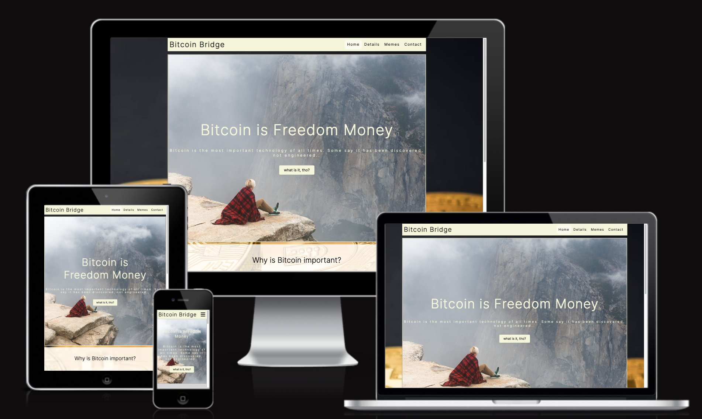

# Contents

* [**User Experience UX**](<#user-experience-ux>)
    * [Wireframes](<#wireframes>)
    * [Site Structure](<#site-structure>)
    * [Design Choices](<#design-choices>)
    *  [Typography](<#typography>)
    *  [Color Scheme](<#color-scheme>)
* [**Features**](<#features>)
    * [**Home**](<#navigation-menu>)
         * [Navigation menu](<#navigation-menu>)
         * [Details](<#details>)
         * [Memes](<#memes>)
         * [Contact](<#contact>)
         * [Footer](<#footer>)
         * [Form Confirmation](<#form-confirmation>)
    * [**Future Features**](<#future-features>)
* [**Technologies Used**](<#technologies-used>)
* [**Testing**](<#testing>)
* [**Deployment**](<#deployment>)
* [**Credits**](<#credits>)
    * [**Content**](<#content>)
    * [**Media**](<#media>)
*  [**Acknowledgements**](<#acknowledgements>)

# User Experience (UX)

## Wireframes

The wireframes for Bitcoin Bridge were produced in [Figma](https://figma.com). There are frames for a full width display and a small mobile device. The final site varies from the wireframes due to developments that occurred during the creation process. 

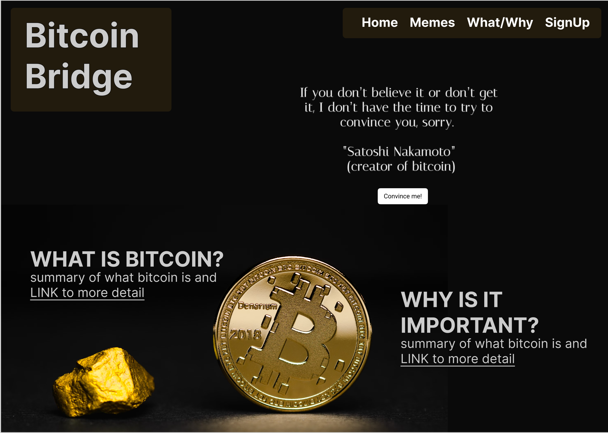

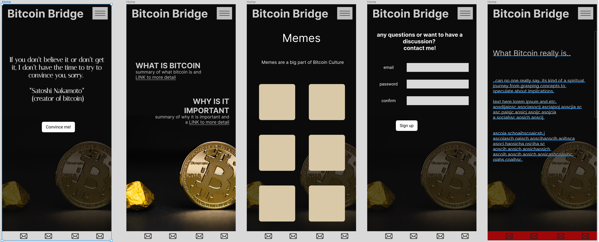 

[Back to top](<#contents>)

## Site Structure

The Bitcoin Bridge website has four pages. The [home page](index.html) is the default loading page, [Details](Details.html), [Memes](memes.html) and [contact](contact.html) pages are all accessible primarily from the navigation menu. 
You may always go back to the landing page by clicking the Bitcoin Bridge logo on the upper left corner

[Back to top](<#contents>)
## Design Choices

 * ### Typography
      The font chosen is 'Inter'. It falls back to sans-serif. 

 * ### Color Scheme

    The color scheme is minimalistic for less distraction and more content focus.
    Beige (rgb 245,245,220) is the main color for most elements / backgrounds due to its pleasing and warm nature. I want the user to feel comforted.

[Back to top](<#contents>)
# Features

Bitcoin Bridge is designed to be user-friendly and inviting, equipped with familiar features like a navigation bar and a contact form. Its overall ambiance aims to be warm and non-intimidating, encouraging users to delve deeper.

## Existing Features  
  * ### Navigation Menu

    * Positioned at the top of every page on the site, it is fully responsive and includes links to all the site's pages, facilitating easy navigation from a single, convenient spot.
    * The logo on the upper left corner provides a way back to the home page when clicked.

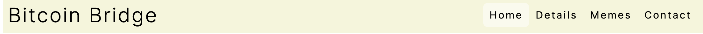
[Back to top](<#contents>)

  * ### Details
    * The "Details" section offers explanations of what Bitcoin is tailored for three distinct audiences: a five-year-old, an average adult, and an IT and financial expert, ensuring the information meets the needs of everyone.

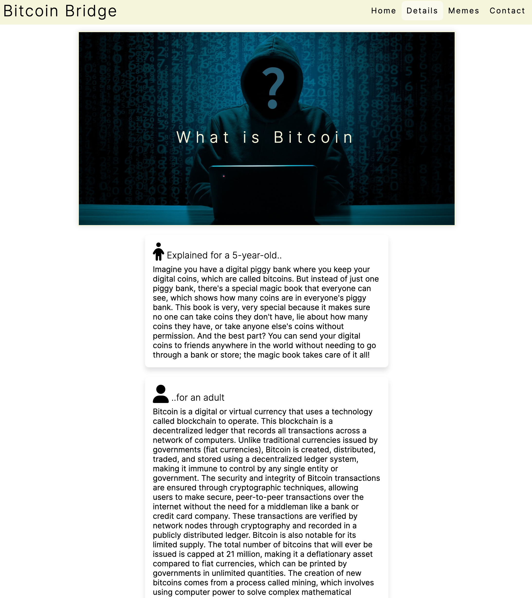
[Back to top](<#contents>)

  * ### Memes

    * The "Memes" section provides the user with some entertaining content which is also a big part of the Bitcoin culture and sometimes even educating by pointing out some intricacies or ins and outs of Bitcoin, the crypto space, the financial markets or the world and the people. The Bitcoin community has the best memes in the space!

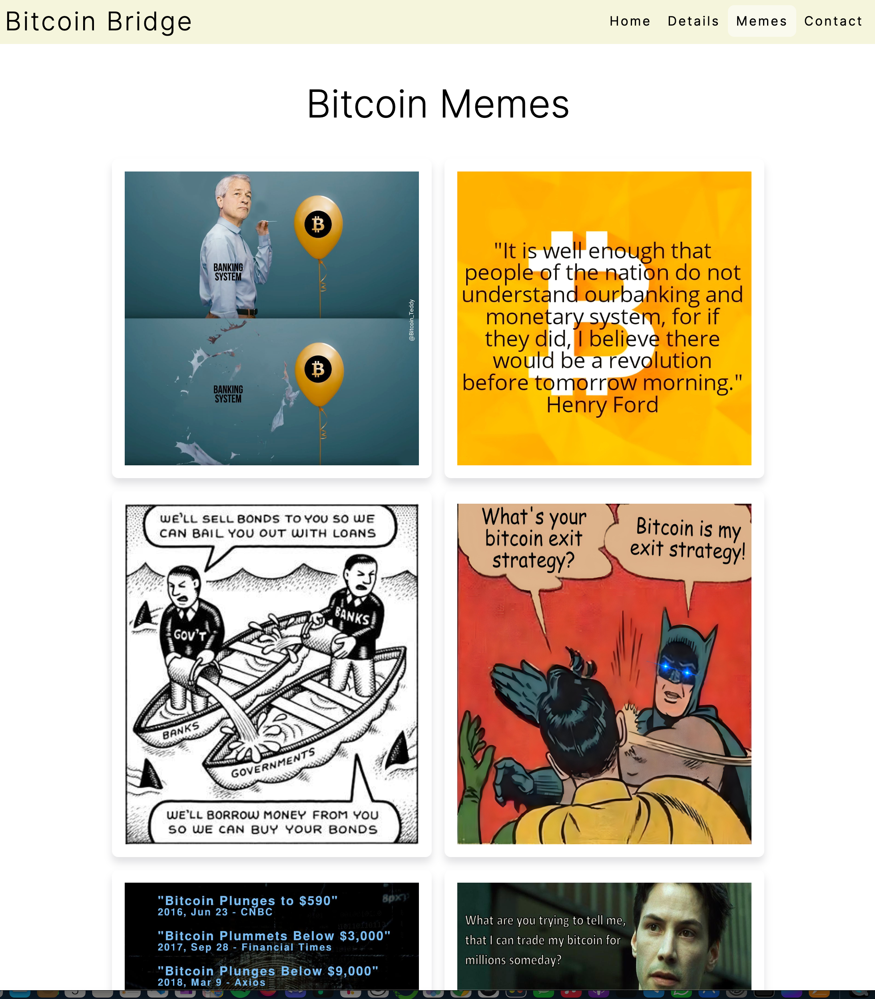
[Back to top](<#contents>)

  * ### contact

    * The "contact" section provides a means to get in touch with the Bitcoin enthusiast responsible for creating this site. It invites users to ask questions or engage in discussions on all things related to Bitcoin.
    * There is a form that the user can choose to fill in. It has 3 input fields, name, email address and a textarea. 

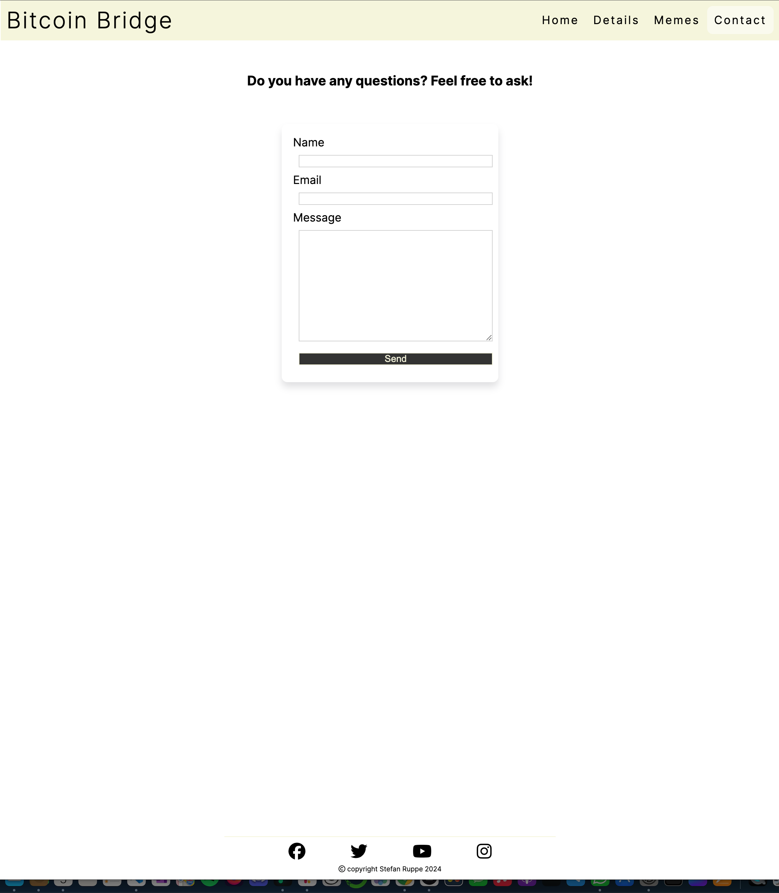
[Back to top](<#contents>)

* ### Footer
    
    * Contains social media links. To enhance the UX the links open in other tabs.
    * The social media presences will help the user with their research into Bitcoin and will also encourage them to connect with the creator of the site..
    

[Back to top](<#contents>)

* ### Form Confirmation
    * This page notifies the user that their details have been successfully submitted to Bitcoin Bridge, serving solely to validate the form for this project.
    * It includes a direct link to the contact page, in addition to the standard navigation menu links found in both the header and footer.

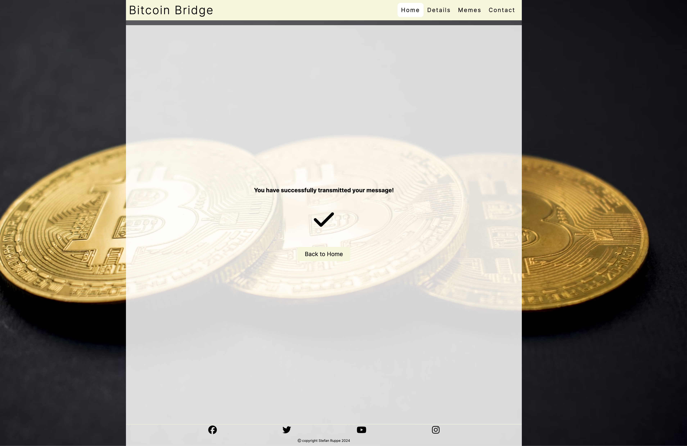
[Back to top](<#contents>)

## Future Features 

* A section on the landing page with interesting data like price development  and active Bitcoin addresses over different timeframes.
Visually appealing with some graphs and interesting stats.
* Revise the "Details" section by dividing it into two distinct pages: one titled "What is Bitcoin," focusing on the basics of Bitcoin, and another named "Why It Matters," which delves deeper into the political and societal implications and consequences of this new form of global currency.

[Back to top](<#contents>)

# Technologies Used
* [HTML5](https://html.spec.whatwg.org/) - provides the content and structure for the website.
* [CSS](https://www.w3.org/Style/CSS/Overview.en.html) - provides the styling.
* [Figma](https://figma.com) - used to create the wireframes.
* [Gitpod](https://www.gitpod.io/#get-started) - used to deploy the website.
* [Github](https://github.com/) - used to host and edit the website.

[Back to top](<#contents>)

# Testing

Please refer to [**_here_**](TESTING.md) for more information on testing Bitcoin Bridge.

[Back to top](<#contents>)

# Deployment

### **To deploy the project**
The site was deployed to GitHub pages. The steps to deploy a site are as follows:
  1. In the GitHub repository, navigate to the **Settings** tab.
  2. Once in Settings, navigate to the **Pages** tab on the left hand side.
  3. Under **Source**, select the branch to **main**, then click **save**.
  4. Once the main branch has been selected, the page will be automatically refreshed with a detailed ribbon display to indicate the successful deployment.

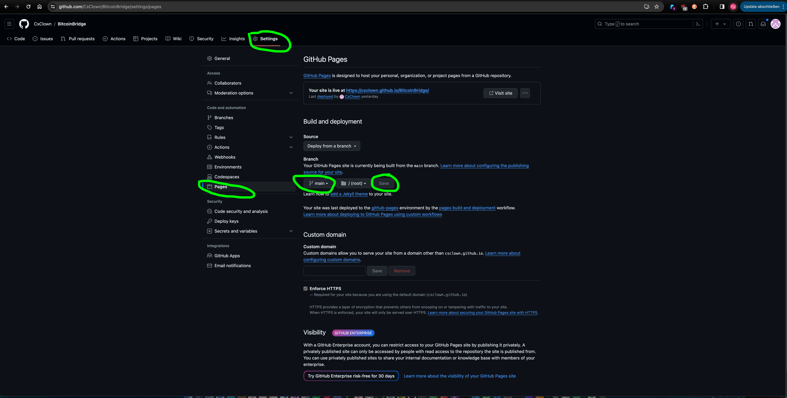

  The live link to the Github repository can be found here - https://github.com/CsClown/BitcoinBridge

### **To fork the repository on GitHub**
A copy of the GitHub Repository can be made by forking the GitHub account. This copy can be viewed and changes can be made to the copy without affecting the original repository. Take the following steps to fork the repository;
1. Log in to **GitHub** and locate the [repository](https://github.com/CsClown/BitcoinBridge).
2. On the right hand side of the page inline with the repository name is a button called **'Fork'**, click on the button to create a copy of the original repository in your GitHub Account.
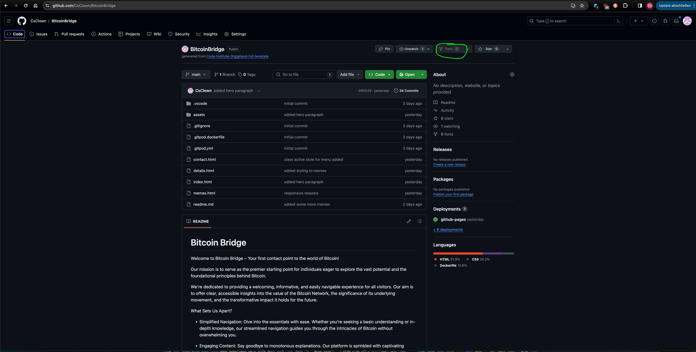

### **To create a local clone of this project**
The method from cloning a project from GitHub is below:

1. Under the repository’s name, click on the **code** tab.
2. In the **Clone with HTTPS** section, click on the clipboard icon to copy the given URL.
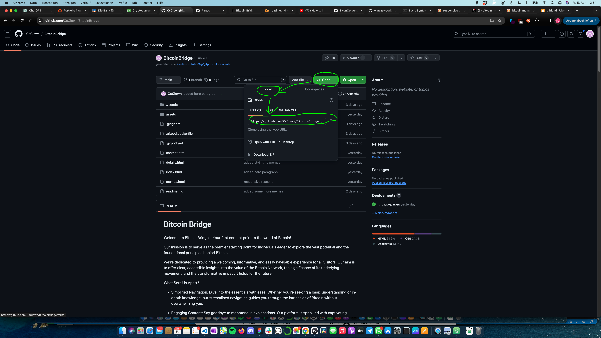
3. In your IDE of choice, open **Git Bash**.
4. Change the current working directory to the location where you want the cloned directory to be made.
5. Type **git clone**, and then paste the URL copied from GitHub.
6. Press **enter** and the local clone will be created.

[Back to top](<#contents>)

# Credits
### Content

* The font came from [Google Fonts](https://fonts.google.com/).
* The icons came from [Font Awesome](https://fontawesome.com/).
* [Figma](https://figma.com) was used to create the wireframes.

### Media
* images were derived from [Unsplash](https://www.unsplash.com) and [Pexels](https://www.pexels.com)
* The photos were compressed using [Compressor](https://compressor.io/).

[Back to top](<#contents>)

# Acknowledgements
The site was completed as a Portfolio 1 Project piece for the Full Stack Software Developer (e-Commerce) Diploma at the [Code Institute](https://codeinstitute.net/). As such I would like to thank my mentor [Precious Ijege](https://www.linkedin.com/in/precious-ijege-908a00168/), the Slack community, and all at the Code Institute for their help and support. 

Stefan Ruppe. 2024

[Back to top](<#contents>)
