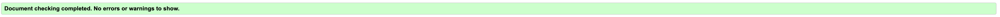
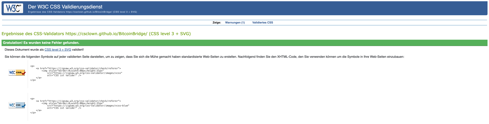
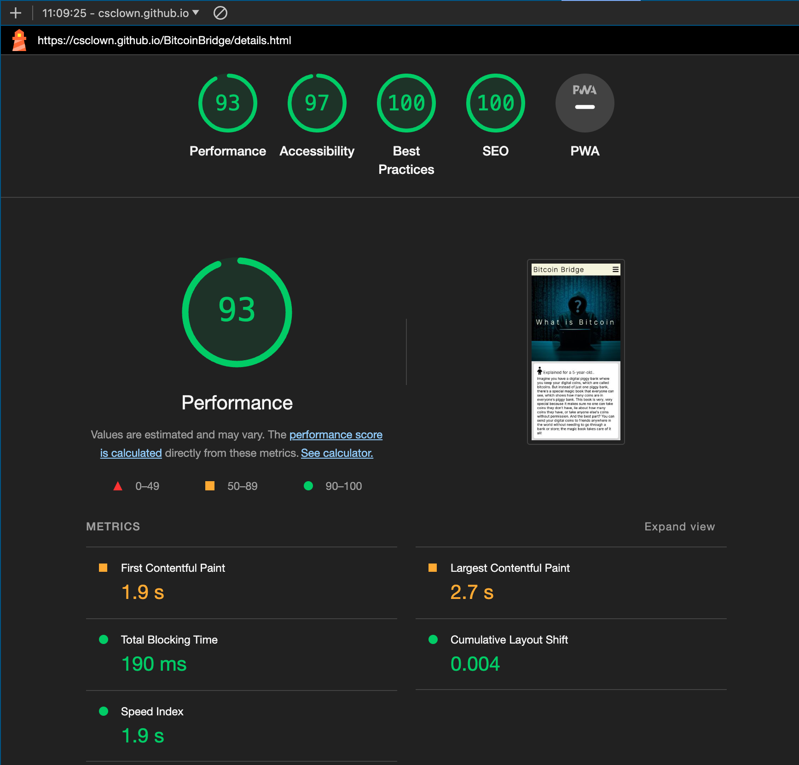

# Testing
## Code Validation
The Bitcoin Bridge site has be throughly tested. All the code has been run through the [W3C html Validator](https://validator.w3.org/) and the [W3C CSS Validator](https://jigsaw.w3.org/css-validator/). Minor errors were found on the home and inspiration pages. After a fix and retest, no errors were returned for both. 

The HTML validator results for each page are below:

* Home page

* Details page

* Memes page

* Contact page

* Form valiadtion page

The CSS validator results are below:

## Responsiveness Test

* The responsive design tests were carried out manually with [Google Chrome DevTools](https://developer.chrome.com/docs/devtools/) and [Responsive Design Checker](https://www.responsivedesignchecker.com/).

|        | Moto G4 | Galaxy S5 | iPhone 5 | iPad | iPad Pro | Display <1200px | Display >1200px |
|--------|---------|-----------|----------|------|----------|-----------------|-----------------|
| Render | pass    | pass      | pass     | pass | pass     | pass            | pass            |
| Images | pass    | pass      | pass     | pass | pass     | pass            | pass            |
| Links  | pass    | pass      | pass     | pass | pass     | pass            | pass            |

Note: On wide display types the contents of the site are restricted in width to 1150px. This helps the UX by not spreading the content too wide on the extra wide screens.

## Browser Compatibility

Bitcoin Bridge site was tested on the following browsers with no visible issues for the user. 
Google Chrome, Microsoft Edge, Safari and Mozilla Firefox. Appearance, functionality and responsiveness were consistent throughout for a range of device sizes and browsers.

## Known Bugs
* ### Resolved

    * Safari wouldnt show Background picture (File type "avif"). Converted to jpg.

* ### Unresolved
    * 

## Additional Testing
### Lighthouse
The site was also tested using [Google Lighthouse](https://developers.google.com/web/tools/lighthouse) in Chrome Developer Tools to test each of the pages for:
* Performance - How the page performs whilst loading.
* Accessibility - Is the site acccessible for all users and how can it be improved.
* Best Practices - Site conforms to industry best practices.
* SEO - Search engine optimisation. Is the site optimised for search engine result rankings.

As an example the results for Wawas Woods home page are below:

This part of the testing process showed up that the site was slow to load, mainly due to the image sizes. All the images needed to be compressed before adding to the repository. Once this was done the performance went from ~73% to ~93%. 

### Peer review
In addition to the above testing the beta version of the site was put through its paces by peers, both in the software development field and outside. All good.

Back to [README.md](./README.md#contents).